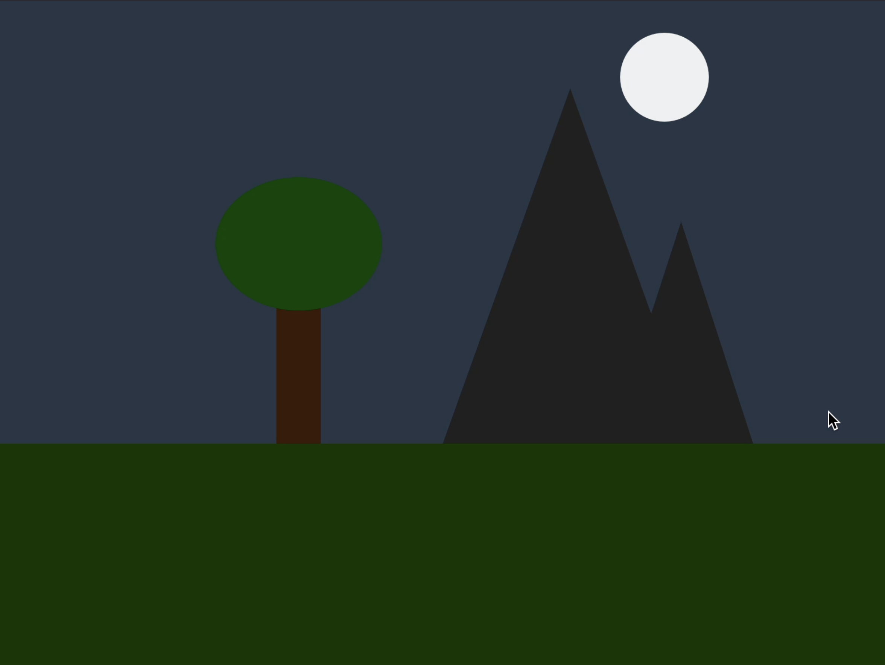

# Day-Night-animation-with-p5.js
An interactive p5.js animation that simulates a day-night cycle. Drag the mouse to watch the sun set, the moon rise, and the landscape transition between day and night.

# 🌅 Interactive Day-Night Cycle Simulation

> Drag the sky and watch the world transform from a bright sunny day 🌞 to a peaceful moonlit night 🌙.

---

## 🎨 Project Overview

This interactive **p5.js** project creates a beautiful landscape featuring:

🏔️ Mountains
🌳 Trees
☀️ Sun
🌙 Moon

Using mouse drag controls, users can experience a smooth transition between day and night.

---
## Preview

  
   
   

## ✨ Features

✅ Interactive mouse controls
✅ Dynamic sunrise and sunset animation
✅ Moonrise and moonset effects
✅ Scenic mountain landscape
✅ Smooth day-to-night transition
✅ Built with p5.js and JavaScript

---

## 🎮 How to Interact

### ➡️ Drag Right

🌞 Sun gradually sets 
🌙 Moon appears in the sky
🌆 Scene transitions into nighttime

### ⬅️ Drag Left

🌙 Moon slowly disappears
🌞 Sun rises again
🌅 Daylight returns to the landscape

---

## 🛠️ Technologies Used

| Technology    | Purpose              |
| ------------- | -------------------- |
| 🎨 p5.js      | Graphics & Animation |
| 💻 JavaScript | Logic & Interaction  |

---

## 📚 What I Learned

🌟 Creating interactive graphics with p5.js

🌟 Using mouse events for user interaction

🌟 Animating objects based on user input

🌟 Building smooth visual transitions

🌟 Designing creative and engaging digital experiences

---

## 📸 Preview

🌄 Day Scene → 🌇 Sunset → 🌃 Night Scene

---

## 👨‍💻 Author

**Yagna**

*"Bringing landscapes to life through code."* ✨
